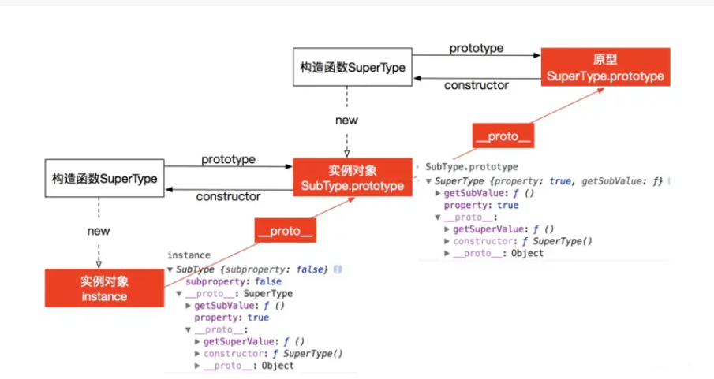

# js的继承

* js 语言的继承不通过class（ES6引入class语法），而是通过“原型对象（prototype）”实现


## 原型链继承

* JavaScript 使用另一套实现方式，继承对象函数并不是通过复制而来，而是通过原型链继承
  ```
    function SuperType()
        this.property = true;
    }
    SuperType.prototype.getSuperValue =  function(){
        return this.property;
    }
    function SubType(){
        this.property = false; 
    }
    // 创建SuperType的实例，并将该实例赋值给SubType.prototype
    SubType.prototype = new SuperType();

    SubType.prototype.getSubValue = function(){
        return this.property
    }
    var instance = new SubType()
    console.log(instance.getSuperValue())  //true
  ```

  


## 借用构造函数继承 call()
----

使用父类的构造函数来增强子类实例，等同于复制父类的实例给子类（不使用原型）

```
   function SuperType(){
       this.color = ["red","green","blue"]
   }
   function SubType(){   //继承SuperType
       SuperType.call(this)
   }
   var instance1 = new SubType();
   instance1.color.push("black");
   alert(instance1.color);  //"red,green,blue,black"

   var instance2 = new SubType()
   alert(instance2.color);  //"red,green,blue"

```
* 核心代码是SuperType.call(this),创建子类实例时调用SuperType构造函数，于是SubType的每个例子都会将SuperType中属性复制一份